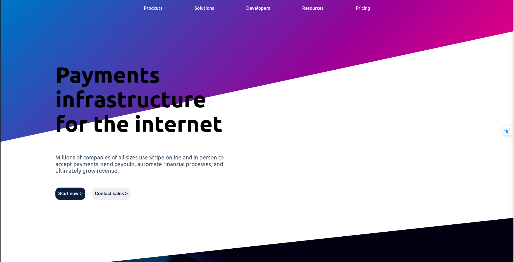
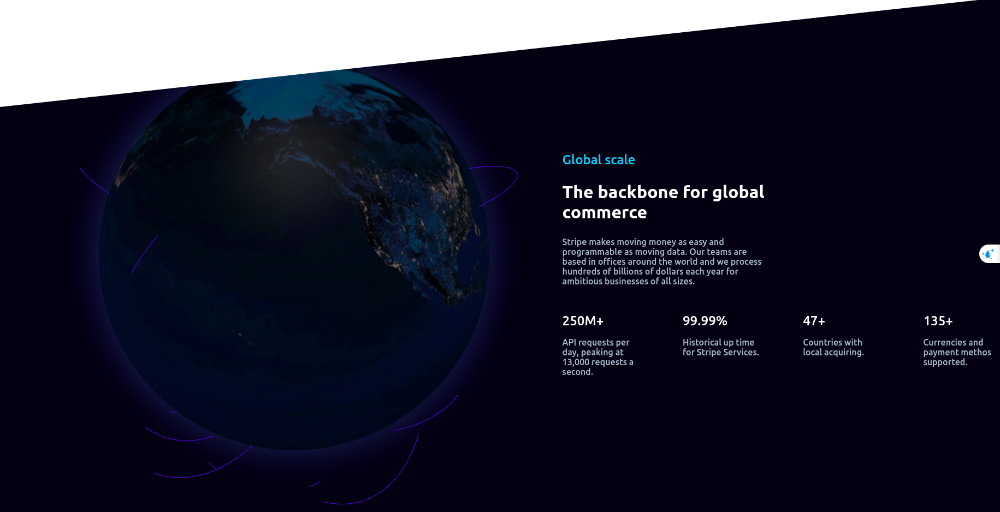

## Reference list
-  [Pure CSS Gradient background color](https://codepen.io/P1N2O/pen/pyBNzX)
-  [Globe random arcs](https://github.com/vasturiano/react-globe.gl/blob/master/example/random-arcs/index.html)
- [Clip path](https://bennettfeely.com/clippy/)




## How to start

```bat
$ npm start
$ npm run dev
```